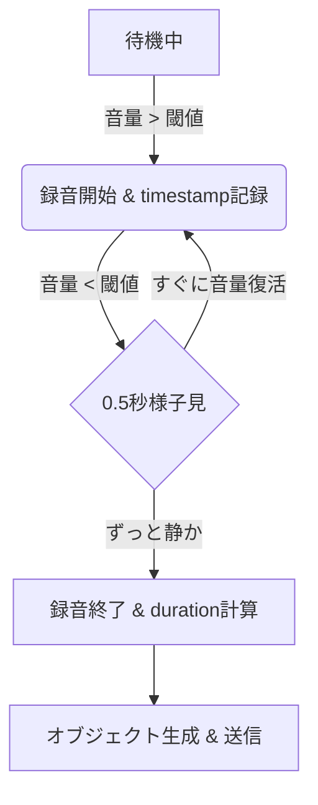
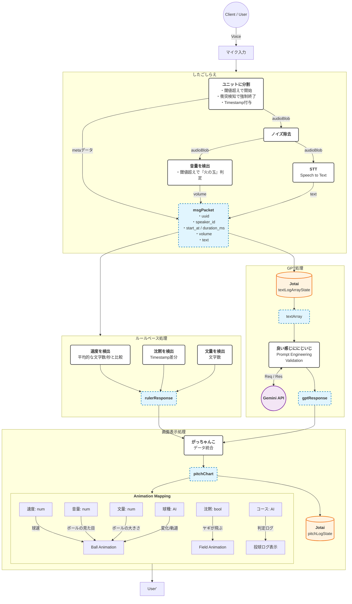

```mermaid
graph TB
    A[待機中] -->|音量 > 閾値| B(録音開始 & timestamp記録)
    B -->|音量 < 閾値| C{0.5秒様子見}
    C -->|すぐに音量復活| B
    C -->|ずっと静か| D[録音終了 & duration計算]
    D --> E[オブジェクト生成 & 送信]
```

```mermaid
graph TB
    %% スタイル定義
    classDef process fill:#fff,stroke:#333,stroke-width:2px,rx:5,ry:5;
    classDef data fill:#e1f5fe,stroke:#0277bd,stroke-width:2px,stroke-dasharray: 5 5,rx:5,ry:5;
    classDef store fill:#fff3e0,stroke:#ef6c00,stroke-width:2px,shape:cylinder;
    classDef external fill:#f3e5f5,stroke:#7b1fa2,stroke-width:2px,rx:5,ry:5;

    %% --- 1. Client & Input ---
    User((Client / User)) -->|Voice| Mic[マイク入力]
    Mic --> PreProcess

    %% --- 2. したごしらえ (Pre-processing) ---
    subgraph PreProcess [したごしらえ]
        direction TB
        UnitDiv[<b>ユニットに分割</b><br/>・閾値超えで開始<br/>・衝突検知で強制終了<br/>・Timestamp付与]:::process
        
        NoiseRed[<b>ノイズ除去</b>]:::process
        VolDet[<b>音量を検出</b><br/>・閾値超えで『火の玉』判定]:::process
        STT[<b>STT</b><br/>Speech to Text]:::process
        
        MsgPacket(<b>msgPacket</b><br/>・uuid<br/>・speaker_id<br/>・start_at / duration_ms<br/>・volume<br/>・text):::data

        UnitDiv -->|audioBlob| NoiseRed
        UnitDiv -->|metaデータ| MsgPacket
        NoiseRed -->|audioBlob| VolDet
        NoiseRed -->|audioBlob| STT
        
        VolDet -->|volume| MsgPacket
        STT -->|text| MsgPacket
    end

    %% --- 3. ロジック分岐 ---
    MsgPacket --> RuleBase
    MsgPacket --> Store_TextLog

    %% --- 4. ルールベース処理 ---
    subgraph RuleBase [ルールベース処理]
        direction TB
        Rule_Speed[<b>速度を検出</b><br/>平均的な文字数/秒と比較]:::process
        Rule_Silence[<b>沈黙を検出</b><br/>Timestamp差分]:::process
        Rule_Len[<b>文量を検出</b><br/>文字数]:::process
        
        Response_Rule(<b>rulerResponse</b>):::data

        Rule_Speed & Rule_Silence & Rule_Len --> Response_Rule
    end

    %% --- 5. AI処理 (GPT/Gemini) ---
    subgraph AI_Process [GPT処理]
        direction TB
        Store_TextLog[(<b>Jotai</b><br/>textLogArrayState)]:::store
        TextArray[textArray]:::data
        PromptEng[<b>良い感じににじいじ</b><br/>Prompt Engineering<br/>Validation]:::process
        Gemini((<b>Gemini API</b>)):::external
        Response_GPT(<b>gptResponse</b>):::data

        Store_TextLog --> TextArray
        TextArray --> PromptEng
        PromptEng <-->|Req / Res| Gemini
        PromptEng --> Response_GPT
    end

    %% --- 6. 画面表示処理 ---
    subgraph Display [画面表示処理]
        direction TB
        Gacchanco[<b>がっちゃんこ</b><br/>データ統合]:::process
        Chart(<b>pitchChart</b>):::data
        Store_Pitch[(<b>Jotai</b><br/>pitchLogState)]:::store

        %% Animation Mapping
        subgraph AnimLogic [<b>Animation Mapping</b>]
            direction TB
            Map_Speed[速度: num] -->|球速| Anim_Ball[Ball Animation]
            Map_Vol[音量: num] -->|ボールの見た目| Anim_Ball
            Map_Silence[沈黙: bool] -->|ヤギが飛ぶ| Anim_Field[Field Animation]
            Map_Len[文量: num] -->|ボールの大きさ| Anim_Ball
            
            Map_Type[球種: AI] -->|変化/軌道| Anim_Ball
            Map_Course[コース: AI] -->|判定ログ| Anim_Log[投球ログ表示]
        end
    end

    %% --- 接続関係 (Main Flow) ---
    Response_Rule --> Gacchanco
    Response_GPT --> Gacchanco
    
    Gacchanco --> Chart
    Chart --> Store_Pitch
    Chart --> AnimLogic

    %% アニメーションからユーザーへのフィードバック
    AnimLogic --> User'
```
