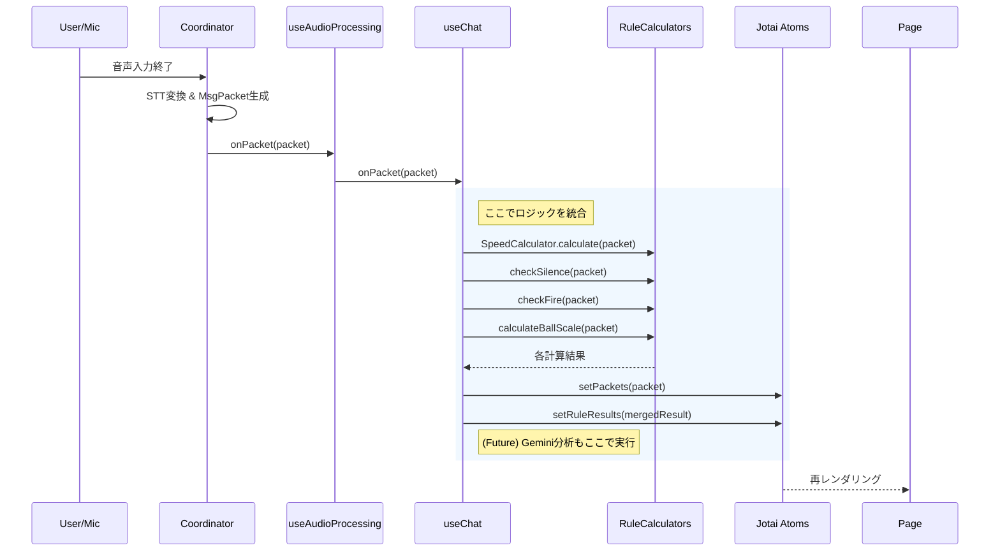

# アーキテクチャ・リファクタリング仕様書

## 1. 概要
現在の「音声処理（インフラ）」と「ゲームルール（ドメイン）」が密結合している状態を解消し、将来的なAI分析（Gemini）の統合を容易にするためのリファクタリングを行う。
新たに `useChat` フックを作成し、ここをアプリケーションのロジック統合の起点（Composition Root）とする。
また、ルールベース処理を責務ごとに分割し、保守性を高める。

## 2. データフロー設計

**変更前:**
`Coordinator` (音声処理 + ルール計算) -> `useAudioProcessing` (State更新) -> `Page`

**変更後:**
`Coordinator` (純粋な音声処理) -> `useAudioProcessing` (イベント通知) -> **`useChat` (統合・計算・保存)** -> `Jotai Atoms` -> `Page`

## 3. コンポーネント詳細仕様

### 3.1. `lib/audio/coordinator.ts` (変更)
*   **役割**: 純粋な音声入出力とパケット生成のみを担当。
*   **変更点**:
    *   `SpeedCalculator` への依存を削除。
    *   `onPacket` コールバックの引数を `MsgPacketType` のみに変更。

### 3.2. `app/talk/hooks/useAudioProcessing.ts` (変更)
*   **役割**: `Coordinator` を React ライフサイクルに適合させるアダプター。
*   **変更点**:
    *   Jotai (`msgPacketArrayState` 等) への依存を削除。
    *   引数として `onPacket: (packet: MsgPacketType) => void` を受け取る。
    *   内部での計算ロジックを全削除。

### 3.3. `lib/rulebase/` (新規作成・分割)
ルールベースロジックを責務ごとに分割する。

*   **`speed.ts` (SpeedCalculator)**:
    *   状態（平均CPS）を持つためクラスとして実装。
    *   `calculate(packet): number` (球速km/hを返す)
*   **`silence.ts`**:
    *   `isSilent(packet): boolean` (沈黙かどうかを返す)
*   **`volume.ts`**:
    *   `isFire(packet): boolean` (火の玉かどうかを返す)
*   **`scale.ts`**:
    *   `calculateBallScale(packet): number` (ボールサイズ倍率を返す)

### 3.4. `app/talk/hooks/useChat.ts` (新規作成)
*   **役割**: チャット機能のファサード。音声処理、ルール計算、AI分析、状態管理を統括する。
*   **責任**:
    1.  `SpeedCalculator` のインスタンス管理 (`useRef`)。
    2.  `useAudioProcessing` の呼び出しとコールバック定義。
    3.  パケット受信時に各ルール計算関数を呼び出し、`RuleBasedResult` オブジェクトを生成。
    4.  Jotai Atom へのデータ保存。
*   **API**:
    *   `running`: boolean
    *   `setRunning`: (val: boolean) => void
    *   `error`: string | null
    *   `canStart`: boolean
    *   `clearLogs`: () => void

### 3.5. `state/ruleBasedResult.ts` (新規作成)
*   **役割**: ルールベース計算結果を保持するグローバルステート。
*   **定義**: `atom<RuleBasedResult[]>`

### 3.6. `app/talk/page.tsx` (変更)
*   **役割**: UI表示のみ。
*   **変更点**:
    *   `useAudioProcessing` の代わりに `useChat` を使用。
    *   `packets` と `ruleResults` を `packetId` で結合して表示。

## 4. 実装ステップ
1.  **State作成**: `state/ruleBasedResult.ts` を作成。
2.  **Rule分割**: `test/rulebase/speed.ts` を分解し、`lib/rulebase/` 配下に再配置。
3.  **Coordinator修正**: `SpeedCalculator` を削除し、純粋化。
4.  **Hook修正**: `useAudioProcessing` をコールバック受け取り型に変更。
5.  **Hook作成**: `useChat` を実装し、ロジックを統合。
6.  **Page修正**: `useChat` を利用するように変更。
